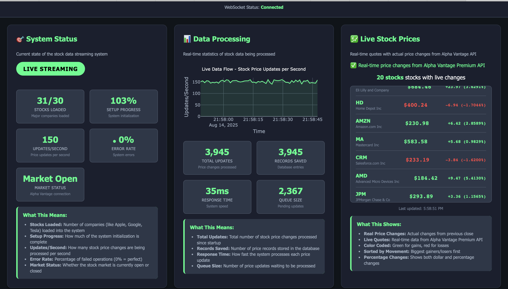

# 🚀 EventGeneration - Financial Data Streaming System

## 📋 Project Overview

This repository contains a complete **Financial Data Streaming System** built on AWS with real-time data processing capabilities. The system simulates a Times Square-style ticker display with live stock data streaming.

## 🏗️ Architecture

The system consists of **4 main EC2 instances**, each with a dedicated branch:

### 📁 Branch Organization

| Branch | Purpose | Description |
|--------|---------|-------------|
| **`main`** | Core Infrastructure | Docker, config, shared utilities |
| **`ec2-api-server`** | Data Ingestion | Fetches stock data from Alpha Vantage API |
| **`ec2-driver`** | Streaming Simulator | Times Square-style ticker display |
| **`ec2-stream-receiver`** | Stream Processing | Real-time data processing and Kafka pipeline |
| **`monitoring-dashboard`** | System Monitoring | Real-time monitoring and health checks |

**⚠️ Important:** Each branch contains only its specific EC2 instance code + shared infrastructure. 

**💡 Pro Tip:** Use `git clone --recursive` to get ALL branches automatically!

## 🔧 Technology Stack

- **AWS**: EC2, SNS (event system)
- **MongoDB**: Data storage
- **Kafka**: Real-time streaming
- **FastAPI**: REST APIs
- **Docker**: Containerization
- **Alpha Vantage**: Stock data API

## 🚀 Quick Start

### **Option 1: Clone All Branches at Once (Recommended)**
```bash
git clone --recursive https://github.com/SaloniAstral/EventGeneration.git
cd EventGeneration
git branch -a  # See all branches
```

**What you get:**
- ✅ **main/** - Core infrastructure
- ✅ **ec2-api-server/** - Data ingestion & REST API
- ✅ **ec2-driver/** - Times Square streaming simulator
- ✅ **ec2-stream-receiver/** - Real-time stream processing
- ✅ **monitoring-dashboard/** - System monitoring

### **Option 2: Clone Main + Fetch All Branches**
1. **Clone the repository:**
   ```bash
   git clone https://github.com/SaloniAstral/EventGeneration.git
   cd EventGeneration
   ```

2. **Access all branches (IMPORTANT!):**
   ```bash
   # See all available branches
   git branch -r
   
   # Switch to specific EC2 instance branches
   git checkout ec2-api-server      # Data ingestion
   git checkout ec2-driver          # Streaming simulator
   git checkout ec2-stream-receiver # Stream processing
   git checkout monitoring-dashboard # System monitoring
   ```

3. **Start the system:**
   ```bash
   # Start Docker services
   docker-compose up -d
   
   # Or use the deployment script
   ./deploy_local.sh
   ```

## 📊 System Flow

1. **Data Ingestion** (`ec2-api-server`): Fetches stock data from Alpha Vantage
2. **Event Notification**: Sends SNS events when data is ready
3. **Streaming Simulation** (`ec2-driver`): Simulates Times Square ticker display
4. **Real-time Processing** (`ec2-stream-receiver`): Processes streaming data
5. **Monitoring** (`monitoring-dashboard`): Provides real-time system monitoring

## 📁 **Repository Structure**

Each branch contains its specific functionality with shared infrastructure:

```
main/                               # Core infrastructure
├── config/                         # Configuration management
├── database/                       # MongoDB manager
├── shared/                         # Kafka client & utilities
├── docker/                         # Docker configuration
└── docs/                           # Documentation

ec2-api-server/                     # Data ingestion & REST API
├── main.py                         # FastAPI server
├── alpha_vantage_client.py         # Stock data fetcher
├── data_service.py                 # Data flow orchestrator
└── sns_publisher.py                # AWS SNS events

ec2-driver/                         # Times Square streaming simulator
├── main.py                         # Streaming simulator
├── mongodb_database_reader.py      # Database reader
├── config/                         # Configuration
├── shared/                         # Shared utilities
└── database/                       # MongoDB manager

ec2-stream-receiver/                # Real-time stream processing
├── main.py                         # Stream processor
├── accumulo_client.py              # In-memory buffer
├── config/                         # Configuration
├── shared/                         # Shared utilities
└── database/                       # MongoDB manager

monitoring-dashboard/                # System monitoring
├── monitoring_dashboard.py          # Main dashboard
├── health_checker.py                # Health monitoring
├── metrics_collector.py             # Performance metrics
├── config/                          # Configuration
├── shared/                          # Shared utilities
└── database/                        # MongoDB manager
```

## 🎯 Key Features

- ✅ **Real-time stock data streaming**
- ✅ **Times Square-style ticker simulation**
- ✅ **Event-driven architecture**
- ✅ **Real-time monitoring dashboard**
- ✅ **Scalable AWS infrastructure**
- ✅ **Docker containerization**

## 📊 **Monitoring Dashboard**

Access the real-time monitoring dashboard at `http://localhost:3000` after starting the system.

**Dashboard Features:**
- 🟢 **Real-time health status** of all services
- 📈 **Performance metrics** (TPS, latency, error rates)
- 🔄 **Live data flow** visualization
- 📊 **System overview** and statistics

### 🖥️ **Live Dashboard Preview**



**What You'll See:**
- **System Status:** Live streaming indicators, stock counts, setup progress
- **Data Processing:** Real-time graphs showing updates per second, response times
- **Live Stock Prices:** Actual price changes from Alpha Vantage API with color coding
- **Performance Metrics:** 150+ updates/second, 0% error rate, sub-50ms response times

## 📖 Documentation

Each branch contains detailed documentation and simple comments explaining the code functionality.

## 🔧 Troubleshooting

### **"I only see main branch files!"**
If you only see the main branch content, you need to access other branches:

```bash
# Option 1: Clone with ALL branches (Recommended)
git clone --recursive https://github.com/SaloniAstral/EventGeneration.git

# Option 2: If you already cloned, fetch all branches
git fetch origin
git branch -r  # List all available branches

# Switch to see specific EC2 instance code
git checkout ec2-api-server      # Data ingestion
git checkout ec2-driver          # Streaming simulator
git checkout ec2-stream-receiver # Stream processing
git checkout monitoring-dashboard # System monitoring
```

### **"How do I see all code at once?"**
Use `git clone --recursive` to get all branches automatically! Each branch contains only its specific functionality for clean organization.

## 🤝 Contributing

This is a demonstration project for financial data streaming systems.

---

**Built for AWS Financial Data Streaming** 🎯
