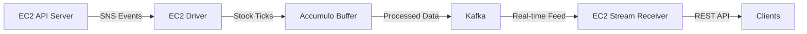

# Financial Data Streaming System - Streaming Guide

## Overview

This guide explains the streaming components of the Financial Data Streaming System, focusing on Kafka and Accumulo integration.

## Architecture



## Components

### 1. Kafka Integration

Kafka serves as the messaging backbone for real-time data processing:

- **Topics:**
  - `stock-ticks`: Main topic for stock price updates
  - `system-events`: System-wide events and notifications

- **Consumer Groups:**
  - `api-server-group`: API server consumers
  - `driver-group`: Driver service consumers
  - `stream-receiver-group`: Stream receiver consumers

- **Configuration:**
```yaml
kafka:
  bootstrap_servers: kafka:9092
  topic_name: stock-ticks
  group_id: financial-streaming-group
  auto_offset_reset: latest
  enable_auto_commit: true
```

### 2. Accumulo Integration

Accumulo acts as a buffer for streaming data:

- **Tables:**
  - `stock_ticks`: Main table for stock tick data
  - Row key format: `timestamp_symbol_ticknumber`

- **Schema:**
```
RowKey: timestamp_symbol_ticknumber
ColumnFamilies:
  - data:
    - symbol
    - price
    - volume
    - timestamp
    - tick_number
    - price_change
    - current_price
    - stream_type
```

- **Configuration:**
```yaml
accumulo:
  instance_name: financial-accumulo
  zookeeper_hosts: zookeeper:2181
  username: root
  password: secret
  table_name: stock_ticks
```

## Data Flow

1. **Data Ingestion:**
   - EC2 API Server fetches stock data
   - Sends SNS event when data is ready

2. **Stream Simulation:**
   - EC2 Driver receives SNS event
   - Starts Times Square simulation
   - Sends ticks to Accumulo

3. **Data Buffering:**
   - Accumulo stores tick data
   - Provides fast access for processing

4. **Stream Processing:**
   - Kafka processes buffered data
   - Enables real-time analytics
   - Distributes to consumers

5. **Data Access:**
   - EC2 Stream Receiver provides REST API
   - Clients can subscribe to real-time updates

## Performance Considerations

1. **Kafka Performance:**
   - Batch size: 100 messages
   - Buffer memory: 32MB
   - Compression: snappy
   - Retention: 24 hours

2. **Accumulo Performance:**
   - Memory: 1GB per tablet server
   - Write buffer: 50MB
   - Cache timeout: 30s
   - Max range scan: 10000 records

## Monitoring

1. **Kafka Metrics:**
   - Producer latency
   - Consumer lag
   - Message throughput
   - Error rates

2. **Accumulo Metrics:**
   - Write latency
   - Read latency
   - Tablet distribution
   - Compaction status

## Error Handling

1. **Kafka Errors:**
   - Producer retries: 3
   - Consumer retries: 3
   - Dead letter queue: `failed-messages`

2. **Accumulo Errors:**
   - Write retries: 3
   - Read timeouts: 30s
   - Error logging and alerts

## Development Setup

1. **Local Environment:**
```bash
# Start Kafka and Zookeeper
docker-compose up -d kafka zookeeper

# Start Accumulo
docker-compose up -d accumulo-master

# Verify services
docker-compose ps
```

2. **Testing:**
```bash
# Run streaming tests
pytest tests/integration/test_streaming.py -v

# Run performance tests
pytest tests/performance/test_performance.py -v
```

## Production Deployment

1. **AWS Setup:**
   - ECS cluster with auto-scaling
   - Load balancer configuration
   - Security group rules

2. **Monitoring:**
   - CloudWatch dashboards
   - SNS alerts
   - Log aggregation

## Troubleshooting

1. **Common Issues:**
   - Kafka connection failures
   - Accumulo tablet errors
   - Data consistency issues

2. **Solutions:**
   - Check network connectivity
   - Verify configurations
   - Monitor system resources

## Security

1. **Authentication:**
   - Kafka SASL/SCRAM
   - Accumulo user roles
   - API key validation

2. **Encryption:**
   - TLS for Kafka
   - SSL for Accumulo
   - HTTPS for APIs

## Best Practices

1. **Development:**
   - Use shared client libraries
   - Implement proper error handling
   - Follow logging standards

2. **Operations:**
   - Regular backups
   - Performance monitoring
   - Capacity planning

## References

1. [Kafka Documentation](https://kafka.apache.org/documentation/)
2. [Accumulo Documentation](https://accumulo.apache.org/docs/2.x/)
3. [AWS ECS Documentation](https://docs.aws.amazon.com/ecs/)